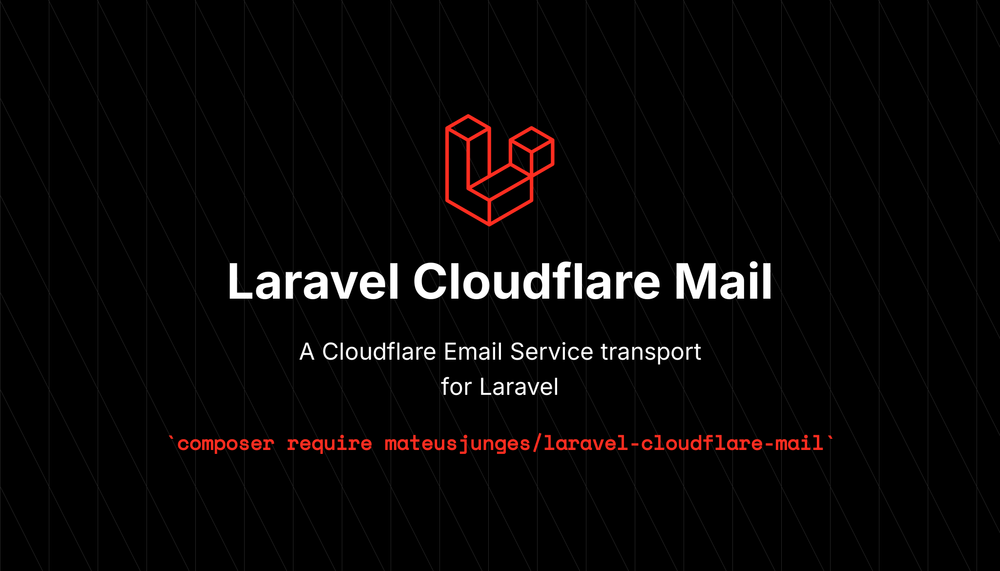

# Laravel Cloudflare Mail


[](LICENSE)
[](https://github.com/mateusjunges/laravel-cloudflare-mail/actions/workflows/ci.yml)



A Laravel mail driver for [Cloudflare Email Service](https://developers.cloudflare.com/email-service/), the outbound email API on Cloudflare's network. Once installed and configured, every `Mail::send`, queued mailable, and notification routes through Cloudflare via Laravel's mail abstraction.

## Requirements

PHP 8.4 or newer. Laravel 12.0 or newer. A Cloudflare account with a verified sender domain and an API token that has the email sending permission.

## Installation

```bash
composer require mateusjunges/laravel-cloudflare-mail
```

The service provider auto registers via Laravel's package discovery. No manual registration needed.

## Quick start

Set the credentials in your `.env`:

```env
CLOUDFLARE_EMAIL_ACCOUNT_ID=your-account-id
CLOUDFLARE_EMAIL_API_TOKEN=your-api-token
MAIL_MAILER=cloudflare
```

Add the `cloudflare` mailer to `config/mail.php`:

```php
'mailers' => [
    // ...
    'cloudflare' => [
        'transport' => 'cloudflare',
    ],
],
```

Add the credentials block to `config/services.php` (the same convention Laravel's built in Postmark and SES drivers follow):

```php
'cloudflare' => [
    'account_id' => env('CLOUDFLARE_EMAIL_ACCOUNT_ID'),
    'api_token' => env('CLOUDFLARE_EMAIL_API_TOKEN'),
],
```

That's it. Your existing mailables and notifications will now be delivered through Cloudflare. Any key set on the mailer block overrides the matching value in `services.cloudflare`, which is handy for scoping a second mailer entry to a different account.

## Documentation

The `docs/` folder covers each topic in more depth:

* [Installation](docs/installation.md). Composer install, local path repositories, and provider registration.
* [Configuration](docs/configuration.md). Environment variables, config files, and Cloudflare dashboard setup.
* [Usage](docs/usage.md). Sending mail through the facade, mailables, notifications, and queued jobs.
* [Error handling](docs/error-handling.md). Exception types, Cloudflare error codes, and retry semantics.

## License

The MIT License (MIT). See [LICENSE](LICENSE) for details.
