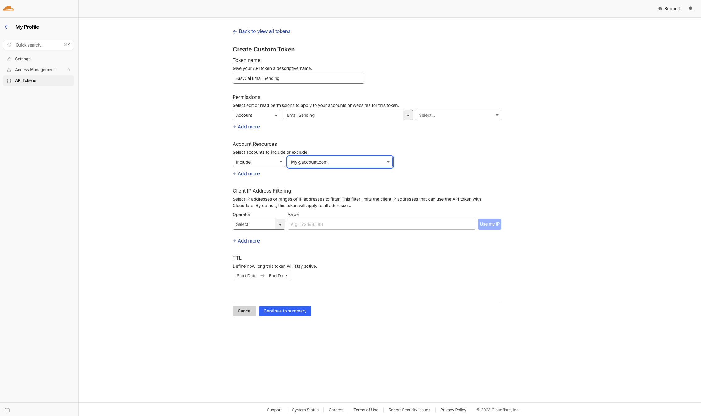

# Configuration

The driver expects three things. A pair of credentials in your environment, a mailer block in `config/mail.php`, and a credentials block in `config/services.php`.

## Environment variables

Add the credentials to your `.env` file:

```env
CLOUDFLARE_EMAIL_ACCOUNT_ID=your-cloudflare-account-id
CLOUDFLARE_EMAIL_API_TOKEN=your-cloudflare-api-token
```

The account ID is visible in the Cloudflare dashboard URL when you open your account. The API token must be scoped with the email sending permission. Create it from the [Cloudflare dashboard](https://dash.cloudflare.com/profile/api-tokens) under "My Profile" then "API Tokens", choose "Create Custom Token", and set the permission group to Account, Email Sending.



To make the new driver the default mailer for the application, set:

```env
MAIL_MAILER=cloudflare
```

You can also leave `MAIL_MAILER` pointed at another driver and explicitly route messages through Cloudflare via `Mail::mailer('cloudflare')`, which is useful during a gradual rollout.

## `config/mail.php`

Register the mailer alongside the other transports. The block only needs the transport name; the credentials live in `config/services.php` (the same convention Laravel's built in Postmark and SES drivers follow).

```php
'mailers' => [
    // ...
    'cloudflare' => [
        'transport' => 'cloudflare',
    ],
],
```

## `config/services.php`

Add the credentials block. The driver reads `services.cloudflare` whenever a value is missing from the mailer block.

```php
'cloudflare' => [
    'account_id' => env('CLOUDFLARE_EMAIL_ACCOUNT_ID'),
    'api_token' => env('CLOUDFLARE_EMAIL_API_TOKEN'),
    'base_url' => env('CLOUDFLARE_EMAIL_BASE_URL'),
],
```

The driver throws a `CloudflareTransportException` at resolution time if either `account_id` or `api_token` is missing or blank in both places, so a misconfigured environment fails loudly the first time you try to send an email through the driver.

## Custom base URL (optional)

`base_url` defaults to the production Cloudflare endpoint (`https://api.cloudflare.com/client/v4`). Set it through the env var (or directly in `services.php` or the mailer block) when you want to point the driver at a different endpoint, for example a regional cluster or a mock server during integration testing.

## Per mailer overrides

Any key set directly on the mailer block wins over the matching value in `config/services.php`. That makes it easy to scope a separate mailer entry to a different Cloudflare account, for example a transactional account and a marketing account:

```php
'mailers' => [
    'cloudflare' => [
        'transport' => 'cloudflare',
    ],
    'cloudflare-marketing' => [
        'transport' => 'cloudflare',
        'account_id' => env('CLOUDFLARE_EMAIL_MARKETING_ACCOUNT_ID'),
        'api_token' => env('CLOUDFLARE_EMAIL_MARKETING_API_TOKEN'),
    ],
],
```

The first entry reads everything from `services.cloudflare`. The second overrides the credentials inline. Route through the second account with `Mail::mailer('cloudflare-marketing')->send(...)`.

## Cloudflare dashboard setup

Before the driver can deliver mail, you also need to complete two setup steps inside Cloudflare itself.

First, verify your sender domain. Cloudflare will not accept a `from` address whose domain has not been verified in your account. The dashboard guides you through the required DNS records (SPF, DKIM, and a verification TXT record).

Second, confirm that your API token grants the email sending permission. A token created with the wrong scope returns HTTP 403 with Cloudflare error code 10203 ("email.sending.error.email.sending_disabled").

## From address

Laravel uses `MAIL_FROM_ADDRESS` and `MAIL_FROM_NAME` as the default sender for outgoing mail. Make sure `MAIL_FROM_ADDRESS` uses a domain you have verified in Cloudflare. Any individual mailable can override this via `Mail::to(...)->from(...)` or the mailable's own `envelope()` method.

## Next step

Continue with [Usage](usage.md) for examples of sending mail through the driver.
